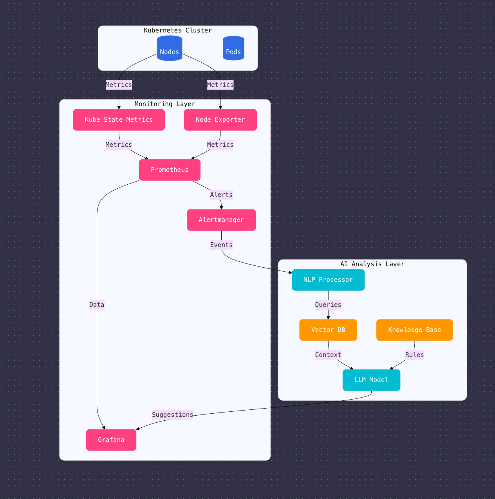

# KubeMonitor
An Automated Pipeline for Kubernetes Cluster Monitoring and AI-Driven Remediation

## Overview
This project automates Kubernetes cluster monitoring using Prometheus and provides AI-driven remediation suggestions for common errors.


## Setup
1. Start Minikube:
   ```bash
   minikube start --driver=docker

2. Deploy Prometheus and Grafana:

   ```bash
    helm install prometheus prometheus-community/kube-prometheus-stack
    ```

3. Deploy the Remediation Engine:

    ```bash
    kubectl apply -f remediation-engine-deployment.yaml

4. Usage
    Access Prometheus at `http://localhost:9090`

    Access Grafana at `http://localhost:3000`

---

### **Demo Workflow**
1. Query the remediation engine:
   ```bash
   curl -X POST http://<remediation-engine-ip>:5000/query -H "Content-Type: application/json" -d '{"query": "Show me all pods with errors"}'
  
  Example response:

  ```
  {
    "remediation": [
      "Pod X is in CrashLoopBackOff. Suggested action: Check the pod logs for errors and restart the deployment."
    ]
  }
  ```